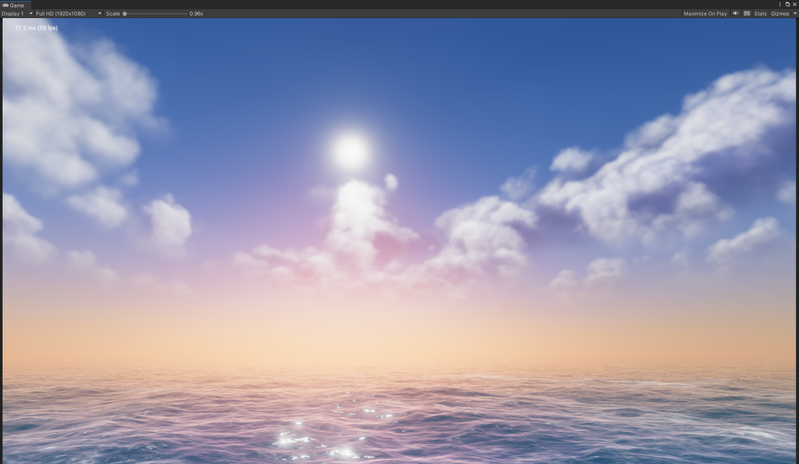
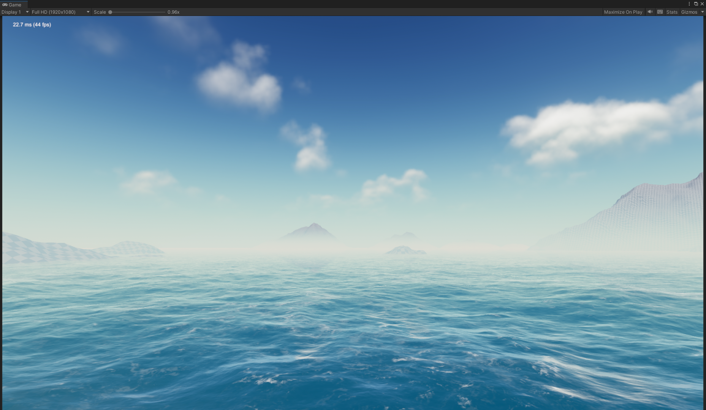
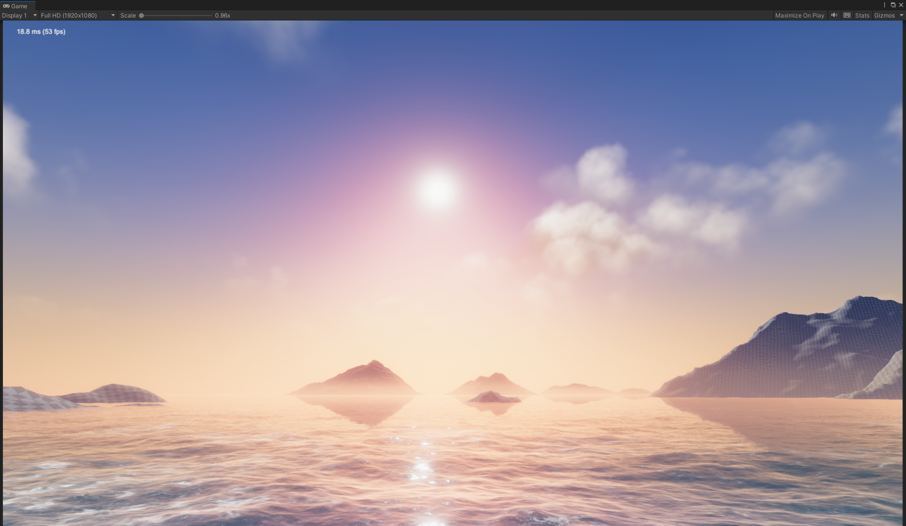
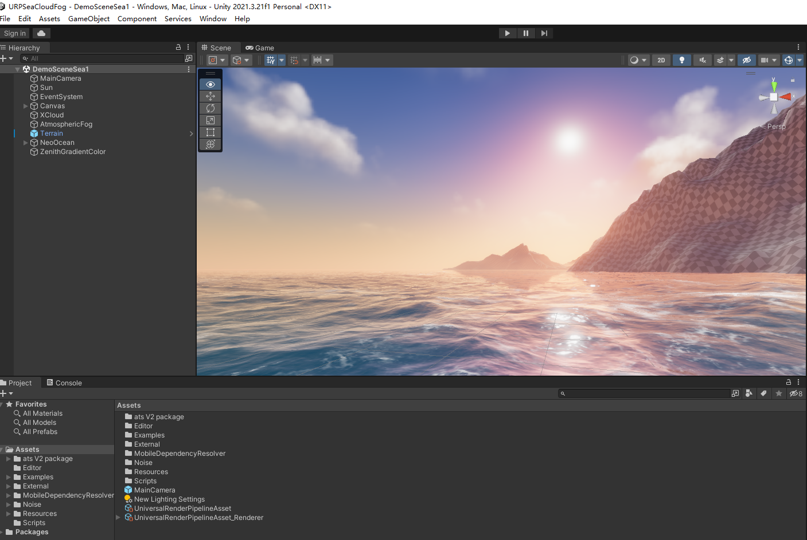
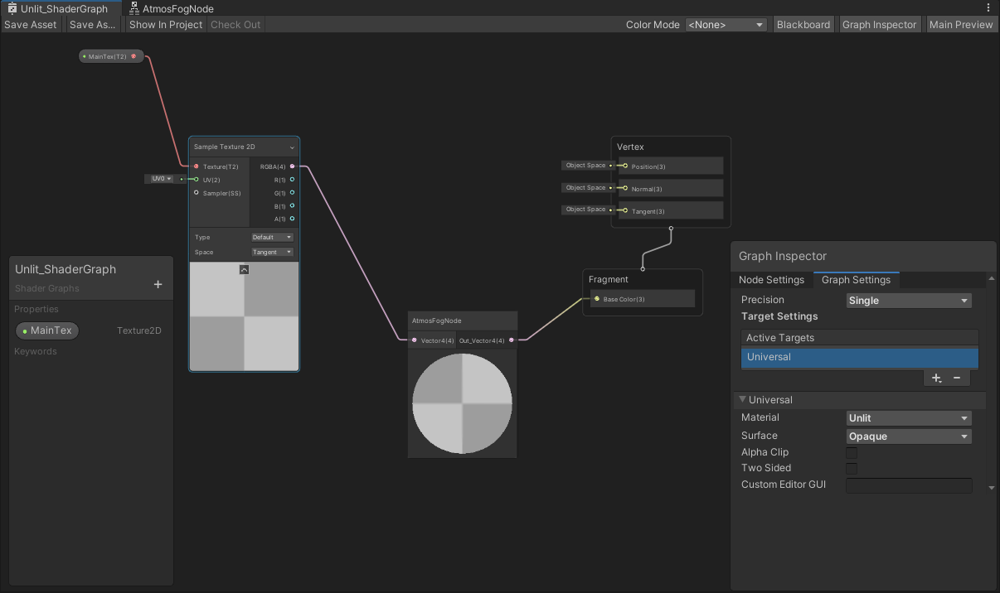
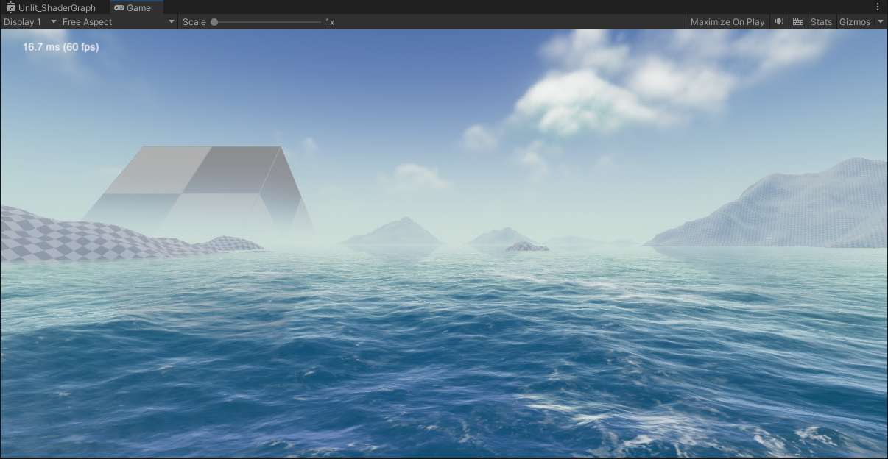

# URPSeaCloudFog

This is an sea&cloud&sky integrated project for height based & atomspheric fog rendering for URP (Unity 2021.3+ and Custom URP 12.1.10).

Atomspheric Fog (Height based)

Height based & Sky Fog

Now supports Unity 2021.3

## Useage
1.To use AtmosFogNode shadersubgraph in the object's shadergraph as follow:

2.To use MixAtmosFog(inout half3 color, float3 worldPos) to object's shader instead of URP's fog builtin-shader code.

For example, in the file TerrainLitPasses.hlsl, to change code as following:  

color.rgb = MixFog(color.rgb, fogCoord); -> MixAtmosFog(color.rgb, worldPos); // need worldPos

Currently, there is an unlit shadergraph in this repository that uses the AtmosFogNode (as shown in the above figure) as the material for the cube.

Reference:  
http://advances.realtimerendering.com/s2017/DecimaSiggraph2017.pdf  
https://github.com/bearworks/URPSeaCloud
